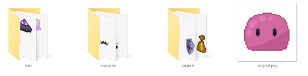
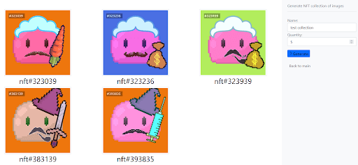

**NFT DJANGO GENERATOR**

Create a collection of avatars images or nft. 

Avatars are generated with the help of a special library. The method consists in randomizing the selected elements and generating the final avatar.

The nft generation works in a similar way, but it requires 4 basic elements to be prepared for further generation: body, hats, mustache, and special subjects.

Avatars and NFTs are created as a collection, so all you need to do is specify the name of the collection and the number of generated images in the form.

---

[Read the blog](https://avivi.pro/en/blog/sharing-the-experience-of-creating-an-nft-collection-using-python/)

